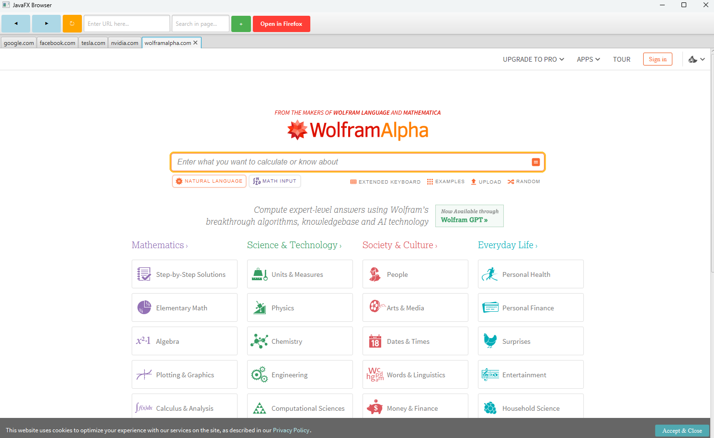

# JavaFX Browser Project

## :newspaper: About the project

This project is a simple yet powerful web browser application built using JavaFX. It offers a seamless browsing experience, allowing users to browse the web effortlessly, open multiple tabs for simultaneous browsing, navigate backward and forward with ease, refresh pages instantly to ensure the latest content, and enter URLs directly to visit specific websites. I use this browser daily, and it has significantly improved my web browsing efficiency and convenience. Whether you're a developer looking for a customizable browser or someone seeking a straightforward and effective web browsing tool, this project is designed to meet your needs.

## Features

* **Seamless Tabbed Browsing:** Effortlessly open multiple tabs to navigate across various websites at once, providing a streamlined and efficient browsing experience.
* **Smart Address Bar:** Enter website URLs with ease using our intelligent address bar that auto-completes URLs with common prefixes and domain extensions, getting you to your destination faster.
* **Intuitive Navigation Controls:** Glide through your browsing history with our smooth forward and backward navigation buttons, making it easy to revisit your favorite sites.
* **Instant Refresh:** Reload your current webpage with a single click to ensure you're always viewing the latest content.
* **Dynamic Tab Titles:** Enjoy a clutter-free browsing experience with tab titles that automatically display the name of the website, making it simple to manage multiple tabs.
* **Quick In-Page Search:** Instantly jump to the search bar by pressing Ctrl + F, allowing you to find specific content on a webpage quickly and efficiently.
* **External Browser Support:** Open websites in your preferred external web browser directly from our app, giving you the flexibility to choose your browsing environment.
* **Hotkey for Tab Management:** Use the convenient Ctrl + W hotkey to close tabs instantly, enhancing your browsing productivity.

## Getting Started

1. Clone this repository to your local machine.

```sh
git clone https://github.com/CH6832/webbrowser-in-java.git
```

2. Open the project in your preferred IDE (e.g., IntelliJ IDEA, Eclipse).

3. Run the `BrowserApplication` class to start the application:



## Usage

1) Upon launching the application, a new tab will be opened with a default web page (e.g., Google).
2) To open a new tab, click the "+" button.
3) Enter a URL in the address bar and press Enter to navigate to the specified website.
4) Use the navigation buttons (Back, Forward, Refresh) to control navigation.
5) Close a tab by clicking the close button (X) on the tab.

## :books: Resources used to create this project

* Java
    * [Java Platform Standard Edition 22 Documentation](https://docs.oracle.com/en/java/javase/)
    * [JavaFX 17](https://openjfx.io/)
* Markdwon
    * [Basic syntax](https://www.markdownguide.org/basic-syntax/)
    * [Complete list of github markdown emofis](https://dev.to/nikolab/complete-list-of-github-markdown-emoji-markup-5aia)
    * [Awesome template](http://github.com/Human-Activity-Recognition/blob/main/README.md)
    * [.gitignore file](https://git-scm.com/docs/gitignore)
* Editor
    * [IntelliJ IDEA Community Edition](https://www.jetbrains.com/idea/download/?section=windows)

## :bookmark: License

This project is licensed under the terms of the [MIT License](LICENSE).

## :copyright: Copyright

See the [COPYRIGHT](COPYRIGHT) file for copyright and licensing details.

## :straight_ruler: Code of Conduct

Please review our [Code of Conduct](CODE_OF_CONDUCT.md) before contributing to this project.